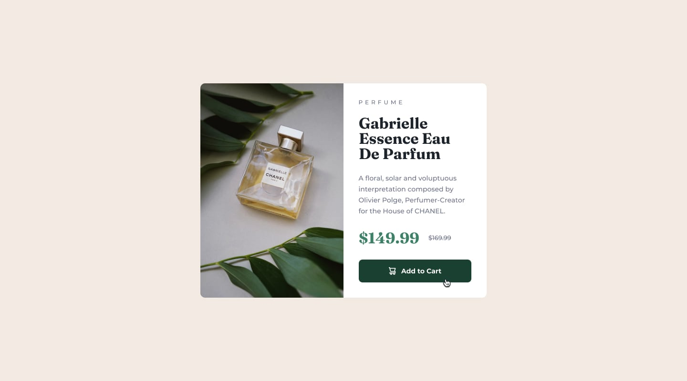

# Frontend Mentor - Product preview card component solution

This is my solution to the [Product preview card component challenge on Frontend Mentor](https://www.frontendmentor.io/challenges/product-preview-card-component-GO7UmttRfa).

## Overview

### The challenge

Users should be able to:

- View the optimal layout depending on their device's screen size
- See hover and focus states for interactive elements

### Screenshot

### Links

- Solution URL: [code](./product-preview-card-component-main/)
- Live Site URL: [live url](https://jrreda.github.io/frontendmentor/product-preview-card-component-main/)

## My process

### Built with

- Semantic HTML5 markup
- Tailwind CSS (browser version)
- Flexbox
- Mobile-first workflow

### What I learned

- Practiced building a responsive card layout using Flexbox.
- Learned how to use Tailwind’s browser build and custom theme configuration.
- Improved understanding of focus and hover states for accessibility.

## Author

- Frontend Mentor - [@jrreda](https://www.frontendmentor.io/profile/jrreda)
